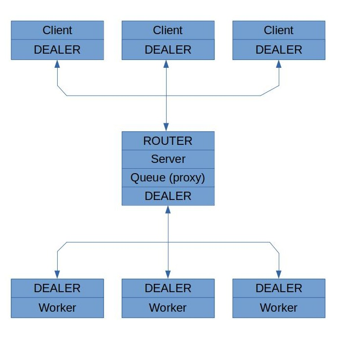

# jac-chat
Chat using zmq sockets with an architecture client-server, but this time the server implements a multithread philosophy and the pattern dispatcher-worker.

## Recordando a 0mq-chat

La implementación de `jac-chat` parte del chat de grupo `0mq-chat` (cliente-servidor) implementado sobre sockets ZMQ en una tarea anterior. `jac-chat` mantiene las funcionalidades de este:

- La comunicación entre cada cliente y el servidor se asíncrona.
- Cada mensaje que llega de un cliente al servidor es enviado a los demás clientes.
- Los clientes son notificados cuando otro entra/sale del chat. 
- Los clientes son notificados cuando el servidor se cierra (`ctrl+C`).
- Si el servidor se reinicia los clientes siguen mateniendo la conexión.

## 0mq-chat VS jac-chat

Sin embargo a diferencia del servidor de `0mq-chat`, el cual desde un mismo hilo, recibía un request, la enviaba a todos los clientes, y una vez que esto se completaba era que podía procesar el siguiente request, `jac-chat` sigue el patrón **Dispatcher-Worker** con una filosofía multihilo en el servidor. El  hilo principal (Dispatcher) recibe los request, los coloca en una cola y otro hilo que este libre, de un conjunto de hilos (Workers), procesa el request enviándolo a todos los clientes que sea necesario. De esta forma el servidor procesa los requests de forma paralela en cada uno de los workers y ofrece un mejor tiempo de respuesta en un escenario de alta concurrencia.

## Implementación

El servidor mutihilo implementado tiene la siguiente estructura.



### Funcionamiento
- El servidor inicia un conjunto de hilos que serán workers. Cada worker crea un socket `DEALER` y luego procesa requests en este socket. Los sockets en los worker se comunican vía `inproc` con el hilo principal.
- El servidor crea un socket `ROUTER` para comunicarse con los clientes y lo vincula a su interfaz externa vía `tcp`.
- El servidor crea un socket `DEALER` para comunicarse con los workers y lo vincula a su interfaz interna vía `inproc`.
- Finalmente el servidor inicia un un proxy (cola) que conecta los dos sockets. El proxy recibe las peticiones entrantes desde los clientes y las distribuye a los workers. También se encarga de enrutar las respuestas de los workers a su destino.

Se emplean sockets de tipo `DEALER` en los clientes porque al igual que en `0mq-chat` no se espera que los clientes reciban ack de el mensaje que han enviado.

Por otra parte es necesario manejar sockets de tipo `DEALER` en los workers para poder enrutar correctamante los mensajes a todos los clientes menos el emisor original (hacer una especie de multicast), esto implica que por cada requests que reciba se deben enviar 0 o múltiples mensajes.

## Requerimientos

Los requerimientos se encuntran en el fichero `requirements.txt`.

## Ejecución

### Servidor

```
usage: server.py [-h] [--name NAME] [--inter INTER] [--port PORT] [--numw NUMW]

optional arguments:
  -h, --help     show this help message and exit
  --name NAME    Server name
  --inter INTER  Server interface to bind. Use 'all' for *
  --port PORT    Server port
  --numw NUMW    Number of worker threads
```

Ejemplo de uso:

```
python3 server.py --name server1 --inter all --port 8080 --numw 5
```

### Cliente

```
usage: client.py [-h] [--name NAME] [--ip IP] [--port PORT]

optional arguments:
  -h, --help   show this help message and exit
  --name NAME  Client name
  --ip IP      Server IP
  --port PORT  Server port
```

Ejemplo de uso

```
python3 client.py --name "John Doe" --ip localhost --port 8080
```